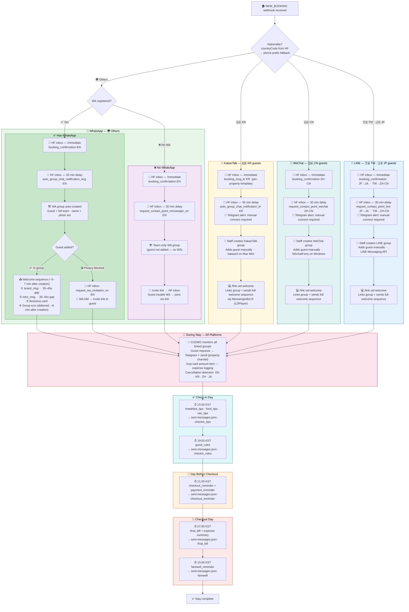

# Booking Automation & Expense Ledger — Feature Status
Built: 2026-06-01 / 2026-06-02

---

## What Was Built

Full pre-stay messenger automation from NEW_BOOKING webhook to guest-connected group chat, plus an in-group expense ledger across all platforms.

---

## Workflow



---

## Google Sheet — Data Source

COZMO reads message content from two tabs in `COZMO_DATA` sheet.

**`booking_msgs`** — columns: EN / KR / JA / ZH-CN / ZH-TW

| Sheet Key | EN | JA | ZH-CN | KR | Used for |
|---|---|---|---|---|---|
| `booking_confirmation` | ✅ | ✅ | ✅ | — | Step 1: general / JP / CN guests |
| `auto_group_chat_notification_eng` | ✅ | — | — | — | Step 2: non-CN/TW/JP/KR guests with WA |
| `request_contact_point_wechat` | — | — | ✅ | — | Step 2: CN guests |
| `request_contact_point_line` | — | ✅ | ✅ | — | Step 2: JP + TW guests |
| `auto_group_chat_notification_kr` | — | — | — | ✅ | Step 2: KR guests |
| `request_wa_invitaion_en` | ✅ | — | — | — | 3.1: WA privacy block — invite link |
| `request_contact_point_messenger_en` | ✅ | — | — | — | 3.2: no WA — push to install |

**`pre_payment_msg`** — columns: EN / KR / JA / ZH-CN / ZH-TW

| Sheet Key | EN | JA | ZH-CN | KR | Used for |
|---|---|---|---|---|---|
| `pre_payment_msg_notice_booking` | ✅ | ✅ | ✅ | ✅ | Step 1.5: Booking.com guests |
| `pre_payment_msg_notice_vrbo` | ✅ | ✅ | ✅ | ✅ | Step 1.5: VRBO / HomeAway guests |

**`booking_msgs_kr`** — columns: one per property (Korean first message, property-specific)

| Sheet Key | SA | BS | SG | SJ | F09 | L09 | B09 | FB | YT | HTA | HTB | HT | JT |
|---|---|---|---|---|---|---|---|---|---|---|---|---|---|
| `booking_msg_kr` | ✅ | ✅ | ✅ | ✅ | ✅ | ✅ | ✅ | ✅ | ✅ | ✅ | ✅ | ✅ | ✅ |

All sheet content ready. HF templates written by Gaya, copied to sheet by Nishat.

---

## 1. First Message — Sent Immediately After Booking

| # | Guest | Sheet Key | Status |
|---|---|---|---|
| 1.1 | General (non-KR/CN/JP) | `booking_confirmation` EN | ✅ |
| 1.1 | Japanese | `booking_confirmation` JA | ✅ |
| 1.1 | Chinese | `booking_confirmation` ZH-CN | ✅ |
| 1.2 | Korean (per property, 13 props) | `booking_msg_kr` → property column | ✅ |

---

## 1.5. Pre-Payment Notice — Sent 1 Minute After Step 1 (Booking.com + VRBO only)

Triggered automatically after Step 1 for OTA guests who require pre-payment. Skipped for all other lead types.

| # | Guest / Source | Sheet Key | Lang | Status |
|---|---|---|---|---|
| 1.5a | Booking.com guest | `pre_payment_msg_notice_booking` | EN/JA/ZH/KO | ✅ |
| 1.5b | VRBO / HomeAway guest | `pre_payment_msg_notice_vrbo` | EN/JA/ZH/KO | ✅ |

**Sheet tab:** `pre_payment_msg` — columns: A:Key, B:EN, C:KR, D:JA, E:ZH-CN, F:ZH-TW

---

## 2. Second Message — Sent 30 Minutes After Booking

Delay handled via `src/data/pending-hf-messages.json` (file-backed queue with `fireAt` timestamp). Replaced `setTimeout` — survives server restarts. On startup, COZMO flushes any overdue entries immediately.

| # | Guest | Sheet Key | Status |
|---|---|---|---|
| 2.1 | Non-CN/TW/JP/KR, has WA | `auto_group_chat_notification_eng` EN | ✅ |
| 2.2 | Non-CN/TW/JP/KR, no WA | `request_contact_point_messenger_en` EN | ✅ |
| 2.3 | Chinese | `request_contact_point_wechat` ZH-CN | ✅ |
| 2.4 | Taiwanese | `request_contact_point_line` ZH-CN | ✅ |
| 2.5 | Japanese | `request_contact_point_line` JA | ✅ |
| 2.6 | Korean | `auto_group_chat_notification_kr` KR | ✅ |

---

## 3. Fallback Scenarios

Auto-triggered by COZMO after group creation attempt (non-CN/TW/JP/KR guests only).

| # | Scenario | Action | Sheet Key | Status |
|---|---|---|---|---|
| 3.1 | Guest on WA but privacy blocks group add | WA invite DM to guest + `request_wa_invitaion_en` via HF inbox | `request_wa_invitaion_en` EN | ✅ |
| 3.2 | Guest has no WA | Team-only group created + `request_contact_point_messenger_en` via HF inbox | `request_contact_point_messenger_en` EN | ✅ |

---

## 4–7. Manual Connect Flows

For KR/CN/TW/JP guests, staff creates the messenger group manually and adds the guest.
Two command shortcuts:
- `/link <uid>` → link only (no messages sent yet)
- `/link <uid> welcome` → link + immediately send all welcome messages in one step
- `/welcome` → send welcome messages to an already-linked group

### 4. WhatsApp (manual fallback)
1. Manager updates guest WA contact in HF
2. Manager runs `/group <uid>` → COZMO creates the group, sends welcome sequence, and starts monitoring ✅

### 5. LINE
1. Manager creates LINE group and adds guest manually
2. `/link <uid> welcome` → COZMO links + sends welcome messages in one step ✅
3. Group name — **not possible** (LINE API does not allow bots to rename groups)

### 6. WeChat
1. Manager creates WeChat group and adds guest manually
2. `/link <uid> welcome` → COZMO links + sends welcome messages in one step ✅
3. Group name — **not possible** (WechatFerry has no group rename API)

### 7. KakaoTalk
1. Manager creates KakaoTalk group and adds guest manually
2. `/link <uid> welcome` → COZMO links + sends welcome messages via MessengerBot R in one step ✅
3. Group name — **not possible** (MessengerBot R cannot rename groups; manual step in app)

---

## 8. Expense Ledger

In-group slash commands for logging and settling guest expenses. Works on all linked platforms (KakaoTalk confirmed; WhatsApp/LINE/WeChat via same `handleExpCommand` interface).

### Logging an expense

```
/exp <card> <amount> <item>
```

**Cards:**

| Code | Name |
|---|---|
| `jy` | Joyhasla |
| `jn` | Jin |
| `rc` | Ricky |
| `cy` | Cyrus |
| `gy` | Gaya |
| `cz` | COZMO |

**Example:** `/exp jy 50000 Airport taxi`

COZMO replies in the group and posts a Jandi notification to both the **expense channel** and the **property channel**. VAT is pre-calculated and stored:
- Raw amount (cash / crypto)
- +10% (bank transfer / WISE)
- +14.5% (card payment)

### Staff commands (group must be `/link`-ed)

| Command | Action |
|---|---|
| `/exp list` | Show all unsettled expenses for this group |
| `/exp total` | Show guest-facing summary with all three VAT tiers |
| `/exp done` | Mark all unsettled expenses settled + Jandi notification |
| `/ckout exp` | Send checkout reminder + expense summary (KakaoTalk) |

### Storage

Google Sheets `expenses` tab — columns: id, lead_uid, group_id, group_name, platform, item, amount_krw, VAT 10%, VAT 14.5%, logged_by, created_at, settled, card.

Auto-cleanup: settled rows older than 7 days are deleted on each cleanup run.

---

## Jandi Channel Routing

All `sendAlert` calls route to Jandi as follows:

| Condition | Destination |
|---|---|
| Alert has a property code + property webhook exists | Property channel only |
| No property code or no webhook (e.g. SWA) | Global COZMO Alert channel (fallback) |
| Expense alert (`/exp log`, `/exp done`) | Expense channel **+** property channel |
| Alert starts with ⚠️ (system errors) | Telegram only — never hits Jandi |
| `telegramOnly: true` (cron summaries) | Telegram only — never hits Jandi |

**Property code resolution:** derived from `lead.propertyName` → `propertyCodeFromName()` → matched against `JANDI_PROPERTY_WEBHOOKS` in `constants.ts`.

Alerts that carry `propertyCode` (routes to property channel):
- NEW_BOOKING, BOOKING_UPDATED, BOOKING_CANCELLED, NEW_INBOX_MESSAGE (telegram.ts)
- Manual connect alerts (KR/CN/JP/TW guests) (telegram.ts)
- Guest request + cancellation detected (all platforms)
- WA Group Created, Group Linked, Welcome Sent (all platforms)

---

## Master Unit Properties — Ops Fan-Out

Two properties are "master" codes that bundle sub-units for guest-facing bookings. From a **staff operations perspective** (housekeeping, check-in alerts, cleaning dispatch), each sub-unit must be treated separately — a single alert for "GK" or "YT" doesn't tell staff which unit(s) to prepare.

### YT — Yeonnam (Lotus · Fish · Bird)

| Code | Name | Type |
|---|---|---|
| `YT` | YT_LOTUS_FISH_BIRD | Master (L9 + F9 + B9) |
| `FB` | YT_FISH_BIRD | Sub-master (F9 + B9) |
| `L9` | YT_LOTUS_09 | Sub-unit |
| `F9` | YT_FISH_09 | Sub-unit |
| `B9` | YT_BIRD_09 | Sub-unit |

### GK — Kelly

| Code | Name | Type |
|---|---|---|
| `GK` | GK_KELLY LUXURY | Master (GKA + GKB) |
| `GKA` | GKA_KELLY ANANDA | Sub-unit A |
| `GKB` | GKB_KELLY PRANA | Sub-unit B |

### Rule
When a master booking (`GK`, `YT`, `FB`) arrives:
- **Guest-facing:** treat as one booking (one group, one welcome sequence)
- **Staff ops (cleaning, check-in alerts, Jandi dispatch):** fan out to each sub-unit individually

> Not yet implemented. Currently master bookings send one combined alert. Sub-unit fan-out is a pending feature.

---

## Nationality Detection Logic

Two sources checked in order — the first non-empty value wins:

1. **`lead.guestInformation.countryCode`** from Hostfully (most reliable)
2. **Phone prefix fallback** — used when Hostfully doesn't return a countryCode (some Airbnb bookings)

```
+886… → TW   (must check before +86)
+82…  → KR
+81…  → JP
+86…  → CN
else  → OTHER (treat as WA / English)
```

`effectiveNationality` is then used to:
- Choose the HF step-1 language (EN / JA / ZH / KO)
- Choose the HF step-2 message (platform invite)
- Decide whether to auto-create a WA group or send a manual-connect alert
- Skip WA group creation for KR/CN/TW/JP phone numbers even if nationality is OTHER

---

## All Active Regex Patterns

| File | Pattern | Purpose |
|---|---|---|
| `whatsapp/detection.ts` | `/\b(no need\|never mind\|cancel\|dont need\|don't need\|no thanks\|it'?s okay\|we can do it (?:ourselves\|ourself)\|we'?ll do it ourselves\|all good now)\b/i` | Cancellation hint — bypasses 30s debounce |
| `whatsapp/detection.ts` | `/guest care team\|coze hospitality\|cozmo ai/i` | Skip staff-signed messages in WA groups |
| `line/detection.ts` | Same cancellation regex + adds KR/CN/JP phrases: `괜찮아요\|취소\|필요없어\|没关系\|不用了\|キャンセル\|大丈夫` | LINE cancellation hint |
| `kakao/detection.ts` | Same multilingual cancellation regex | Kakao cancellation hint |
| `kakao/detection.ts` | `/^✅ Linked!\|guest care team\|coze hospitality\|cozmo ai/i` | Skip COZMO's own replies in Kakao |
| `wechat/detection.ts` | Same multilingual cancellation regex | WeChat cancellation hint |
| `wechat/bot.ts` | `/^\[(?:EN\|JA\|ZH-CN\|ZH-TW\|TH)\]/` | Skip COZMO's own translation relay messages |
| `wechat/bot.ts` | `/<title>([\s\S]*?)<\/title>/` | Extract reply text from WeChat quoted-reply XML (type 49) |
| `wechat/bot.ts` | `/^\/link\s+([^\s]+)(?:\s+([^\s]+))?\s*$/i` | Parse `/link <uid> [lang\|welcome]` |
| `line/routes.ts` | `/^\[(EN\|ZH-CN\|ZH-TW\|JA\|TH\|cont\.)\]/` | Skip COZMO's own translation relay messages in LINE |
| `kakao/routes.ts` | `/^\/link\s+([^\s]+)(?:\s+(welcome))?\s*$/i` | Parse `/link <uid> [welcome]` |
| `expenses.ts` | `/^\/exp\s+(jy\|jn\|rc\|cy\|gy\|cz)\s+(-?\d+)\s+(.+)$/i` | Parse `/exp <card> <amount> <item>` |

**Note:** WA `CANCELLATION_HINT_REGEX` is English-only. LINE/Kakao/WeChat versions include Korean, Chinese, and Japanese phrases.

---

## Google Calendar — Booking Sync

Every `NEW_BOOKING` creates an all-day event on the property's Google Calendar. `BOOKING_UPDATED` patches it; `BOOKING_CANCELLED` deletes it.

**Calendar names** (shared via Joyhasla Google account, accessible to full team):

| Calendar Name | Property Code |
|---|---|
| `BS_COZMO` | BS |
| `SG_COZMO` | SG |
| `SJ_COZMO` | SJ |
| `SA_COZMO` | SA |
| `JT_COZMO` | JT |
| `JTS_COZMO` | JTS |
| `GKA_COZMO` | GKA |
| `GKB_COZMO` | GKB |
| `YTA_B9_COZMO` | B9 |
| `YTB_L9_COZMO` | L9 |
| `YTC_F9_COZMO` | F9 |

**⚠️ Calendar end date is set to one day BEFORE the actual checkout date.**

Google Calendar all-day `end` is exclusive — the end date itself is not displayed. We pass the real checkout date directly (no +1), so a booking checking out June 15 displays as ending June 14. This prevents visual overlap when the next guest checks in on the same day (check-out 15:00, check-in 15:00 same day).

**Do not add +1 day back.** `src/services/calendar.ts` uses `checkOut` directly as `end.date`.

Existing calendar events retain the old (inclusive) end date until the next `BOOKING_UPDATED` webhook or a manual backfill: `node scripts/backfill-calendar.js`.

---

## Correct Booking Sequence (EN guests with WA)

1. **Immediately** — Step 1 HF inbox queued (`booking_confirmation`)
2. **Immediately** — WA registration checked
3. **Immediately** — Step 2 HF inbox queued (`fireAt: now+30min`)
4. **Immediately** — Group creation queued (`fireAt: now+30min`, held until Step 2 confirmed sent)
5. **~30 min** — Step 2 HF inbox fires: `auto_group_chat_notification_eng` ("your WA group is ready")
6. **After Step 2 confirmed** — WA group created + welcome messages sent

Group creation will NOT proceed until `sent-messages.json` shows `hf_step2` (or `hf_no_wa`) marked for that lead. This guarantees the guest always receives the HF inbox notification before the WA group appears.

---

## WhatsApp Auto Group — Welcome Message Sequence

When COZMO creates a WA group automatically on `NEW_BOOKING`, the following messages are sent in order. Delays are intentionally long to avoid triggering WhatsApp's spam/ban detection on new groups.

**Full creation timeline:**

| Time after group created | Action |
|---|---|
| T + 30s | Set group to non-announcement mode |
| T + 2 min | Promote staff + guest to admin (guest needs it to add friends/family) |
| T + 5 min | Send `brand_msg` |
| T + 5 min 35–45s | Send `intro_msg` |
| T + 6 min 20–30s | Send business card image |
| T + ~10 min | Upload group icon (fully deferred, fire-and-forget) |

**Message sequence:**

| # | Message | Source |
|---|---|---|
| 1 | Brand message | `brand_msg` from Sheets |
| 2 | Intro message | `intro_msg` from Sheets |
| 3 | Business card image | `business_card_url` from Sheets or local file |

**Removed from sequence (2026-06-10):**
- ~~Group status message~~ — removed (extra write on new group triggered WA spam detection)
- ~~AI-generated personal welcome~~ — not implemented (was a planned step, never shipped)

**Why delays are long:** COZMO uses Evolution API (unofficial) + creates groups proactively. Too many API writes on a new group in a short time triggers WA spam detection. Delays are the only mitigation available without losing group functionality.

The same 3-message sequence fires when staff runs `/welcome` or `/link <uid> welcome` manually on any platform (without the 5-min initial delay — that only applies to auto-creation).

---

## Why Auto Group Creation Is Not Possible on LINE / WeChat / KakaoTalk

| Platform | Why auto creation is blocked |
|---|---|
| **LINE** | LINE's Messaging API only allows bots to *receive* messages in groups they are already a member of. Bots cannot create groups or invite users — only humans can do that. LINE enforces this at the API level with no workaround. |
| **WeChat** | WechatFerry hooks into the WeChat PC client's local database. It can read and send messages in existing groups but has no API for creating groups — WeChat PC itself doesn't expose a scriptable group-creation interface. |
| **KakaoTalk** | MessengerBot R on LDPlayer handles receive + send. kakaocli on Mac Mini provides sender_id enrichment only. KakaoTalk has no public API — group creation via any automation is too fragile; manual step required. |

**Summary:** WhatsApp is the only platform where COZMO can fully automate group creation because Evolution API (an open-source WhatsApp gateway) provides a real group management API. On all other platforms, group creation is a human step — COZMO joins after the staff creates the group and connects it with `/link`.

---

## Why Group Renaming Is Not Possible on LINE / WeChat / KakaoTalk

| Platform | Group rename | Reason |
|---|---|---|
| **WhatsApp** | ✅ Set on creation | Evolution API supports `updateGroupSubject` |
| **LINE** | ❌ Not possible | LINE Messaging API has no endpoint to rename groups — only human members can do this in the app |
| **WeChat** | ❌ Not possible | WechatFerry has no group rename function exposed in its SDK |
| **KakaoTalk** | ❌ Not possible | kakaocli has no rename command; would require unreliable UI automation |

Staff must rename LINE/WeChat/KakaoTalk groups manually in the app after creation.

---

## What COZMO Cannot Do — Hard Limits

### Auto Group Creation
| Platform | Why not possible |
|---|---|
| **LINE** | LINE Messaging API is receive-only in groups. Bots cannot create groups or invite users. LINE enforces this at the API level — no workaround exists. |
| **WeChat** | WechatFerry hooks into the WeChat PC local SQLite database. It can read and send messages but has no interface to create groups. WeChat PC itself provides no scriptable group-creation API. |
| **KakaoTalk** | MessengerBot R on LDPlayer handles receive + send. No public API exists for group creation. |

### Group Renaming
| Platform | Why not possible |
|---|---|
| **LINE** | The LINE Messaging API has no endpoint to rename groups. Only human members can do this inside the app. |
| **WeChat** | WechatFerry's SDK has no group rename function. |
| **KakaoTalk** | MessengerBot R cannot rename groups — manual step in app. |
| **WhatsApp** | ✅ COZMO sets group name on creation via Evolution API. Can also change it later. |

### Message History / Backfill
| Platform | Why not possible |
|---|---|
| **WhatsApp** | End-to-end encrypted. COZMO can only read messages sent after `/link`. No access to history before it joined. |
| **LINE / WeChat / KakaoTalk** | Same — COZMO only sees messages from when it was added to the group. |

### Listing Group Members
| Platform | Status |
|---|---|
| **WhatsApp** | ✅ COZMO can query participants via Evolution API (`/group/participants`) |
| **LINE** | ❌ LINE API does not allow bots to list group members (requires verified/official account) |
| **WeChat** | ✅ `agent.getChatRoomMembers()` — available via WechatFerry |
| **KakaoTalk** | ❌ MessengerBot R has no member-listing capability |

### Sending to Guest Directly (DM)
| Platform | Status |
|---|---|
| **WhatsApp** | ✅ COZMO can DM any WA number via Evolution API |
| **LINE** | ❌ Bot can only push to groups/users who have already talked to it |
| **WeChat** | ❌ WechatFerry cannot initiate new DM conversations |
| **KakaoTalk** | ❌ MessengerBot R cannot initiate DM conversations |

### Reading Message History Before COZMO Joined
Not possible on any platform — all are E2E encrypted or session-scoped. COZMO only processes messages received in real-time after being added to the group.

---

## COZMO Code — Platform Status

| Platform | `/link <uid>` | `/link <uid> welcome` | `/welcome` | Auto group | Group rename | `/exp` |
|---|---|---|---|---|---|---|
| WhatsApp | ✅ | ✅ | ✅ | ✅ on NEW_BOOKING | ✅ on create | ✅ |
| LINE | ✅ | ✅ | ✅ | ❌ API limitation | ❌ API limitation | ✅ |
| WeChat | ✅ | ✅ | ✅ | ❌ no create API | ❌ SDK limitation | ✅ |
| KakaoTalk | ✅ | ✅ via MessengerBot R | ✅ via MessengerBot R | ❌ no scriptable API | ❌ no scriptable API | ✅ |

---

## Restart Resilience & Deduplication (added 2026-06-05)

### Message delivery guarantees

| Queue file | What it covers | Flush trigger |
|---|---|---|
| `src/data/pending-messages.json` | WA welcome messages (brand_msg, intro_msg, business card) | WA reconnect + watchdog every 5 min |
| `src/data/pending-hf-messages.json` | HF inbox Step 1 & Step 2 messages (30-min delayed) | Startup (10s) + every 2 min |
| `src/data/reply-watchdog.json` | WA groups awaiting a reply (48hr WA unanswered counter) | Watchdog every 5 min |

**WA welcome queue:** Enqueued **before** `sendBookingMessages` starts sleeping. Dequeued only on success. If server restarts mid-sequence, messages retry automatically on next WA reconnect.

**HF inbox queue:** Replaces bare `setTimeout`. Each entry has a `fireAt` ISO timestamp. On startup, any overdue entry fires immediately.

### Deduplication — `src/data/sent-messages.json`

All automated messages are tracked per group by type. Before any message fires, COZMO checks this file and skips if already sent. Marked on success.

| Key format | Message type | Marked when |
|---|---|---|
| `groupKey:welcome` | Welcome sequence | Auto-send succeeds OR team runs `/welcome` |
| `groupKey:checkin_tips` | Check-in tips (15:00 KST) | Sent by cron |
| `groupKey:checkin_rules` | Guest rules (19:00 KST) | Sent by cron |
| `groupKey:checkout_reminder` | Checkout reminder (21:00 KST) | Sent by cron |
| `groupKey:farewell` | Farewell (15:00 KST checkout day) | Sent by cron |
| `groupKey:final_bill` | Final bill (07:00 KST checkout day) | Sent by cron |

### Missed cron catch-up

30 seconds after every restart, COZMO checks the current KST hour and re-runs any cron function whose scheduled time has already passed today. Because all sends check `sent-messages.json` first, already-sent messages are silently skipped — only genuinely missed ones go out.

---

## WA Ban Protection (added 2026-06-10)

### Reply Watchdog
WhatsApp 2026 tracks unanswered messages on a rolling 30-day counter. If a group receives no reply within 48 hours, it counts against the number as a spam signal.

**How it works:**
- After welcome messages are sent successfully → group added to `reply-watchdog.json`
- Any non-COZMO message in the group (staff or guest) → group removed immediately
- Watchdog checks every 5 min (piggybacks on existing WA connection check)
- If 30 hours pass with no reply → Jandi alert fires to the property channel:

```
⏰ No Reply Yet — WA Group
─────────────────
👤 Guest: [Name]
🏠 Property: [Property]
⚠️ 18 hours left to reply before WhatsApp flags the group
─────────────────
via COZMO · COZE Hospitality
```

Alert fires **once only** per group. Staff reply in the group → next check clears it.

### "Group Created" Jandi Alert
Now includes guest phone number so staff know who to expect in the group:

```
👥 WhatsApp Group Created
📱 Phone: +[number]
👤 Guest: [Name]
🏠 Property: [Property]
...
```

---

## Milestone

✅ Full pre-stay messenger automation complete.
Every NEW_BOOKING results in a connected group — auto for WA guests (brand_msg + card + intro from Sheets), staff handoff alerts for all other platforms.

✅ `/link <uid> welcome` shortcut live on all platforms.
One command to link and send the full welcome sequence.

✅ Expense ledger live across all platforms.
Staff log, review, and settle guest expenses in-group. VAT tiers calculated automatically. Jandi notified on every log and settle (expense channel + property channel).
