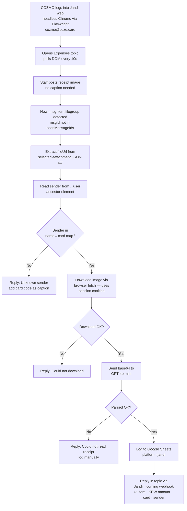

# Jandi Receipt Scan — Playwright Bot

## Status

| Step | Status |
|---|---|
| COZMO account created (`cozmo@coze.care`) | ✅ Done |
| Added to Dev Tests topic for testing | ✅ Done |
| Playwright login + room navigation | ✅ Working |
| DOM polling for new image messages | ✅ Working |
| Sender name auto-detection (no caption needed) | ✅ Working |
| Image download via browser `fetch()` | ✅ Fixed (was timing out via `page.request.get`) |
| GPT-4o mini receipt parsing | ✅ Wired up — testing in progress |
| Google Sheets logging | ✅ Wired up — testing in progress |
| Jandi reply via incoming webhook | ✅ Working |
| Move to production Expenses topic | 🔲 Pending |
| Add remaining staff to sender→card map | 🔲 Pending |

---

## How It Works

Staff just posts the receipt image in the Jandi Expenses topic. No caption, no commands. COZMO does everything.



---

## Architecture

```
cozmo-bridge (pm2)
  └── initJandiWatcher() — starts 15s after server boot
        └── Playwright headless Chrome
              └── Logged in as cozmo@coze.care
                    └── Expenses topic open (JANDI_WATCH_ROOM_ID)
                          └── poll() every 10s
                                └── getImageMessages() — reads DOM
                                └── downloadImage() — browser fetch() with session
                                └── parseReceipt() — GPT-4o mini
                                └── logJandiReceipt() — Google Sheets
                                └── sendJandiRich() — Jandi incoming webhook reply
```

---

## Sender → Card Map

Auto-assigned by Jandi display name. No caption needed.

| Jandi display name contains | Card | Description |
|---|---|---|
| nishat | cz | COZMO card |
| ricky | rc | Ricky |
| jin | jn | Jin |
| cyrus | cy | Cyrus |
| gaya | gy | Gaya |
| joyhasla | jy | Joyhasla |

Caption override: if the image has a caption with a card code (`jy`, `jn`, `rc`, `cy`, `gy`, `cz`), it takes priority over the sender map. Useful for posting on behalf of someone else.

---

## Config (ecosystem.config.js)

| Key | Value | Notes |
|---|---|---|
| `ENABLE_JANDI_WATCHER` | `true` | Master switch for Playwright bot |
| `JANDI_EMAIL` | `cozmo@coze.care` | COZMO's Jandi account |
| `JANDI_PASSWORD` | `cosecare2023#*` | |
| `JANDI_TEAM_URL` | `https://cose.jandi.com` | |
| `JANDI_WATCH_ROOM_ID` | `35436954` | Dev Tests (change to Expenses for prod) |
| `JANDI_EXPENSE_WEBHOOK` | test webhook URL | Reply goes here (change to Expenses webhook for prod) |
| `OPENAI_API_KEY` | set | Used for GPT-4o mini |

---

## DOM Selectors (confirmed from live DOM inspection)

| What | Selector |
|---|---|
| File/image message | `.msg-item.filegroup[message-id]` |
| File metadata (URL, MIME) | `[selected-attachment]` attribute → JSON → `content.fileUrl`, `content.type` |
| Message caption | `.msg-text-box` textContent |
| Sender name | `._user` element found by walking up 2–3 ancestor levels |

**Key quirk:** The sender name is NOT inside the file message item — it's in a `._user` element on the parent message group. The watcher walks up ancestors to find it.

**Key quirk:** Image files are at `https://files.jandi.com/files-private/...` and require an authenticated session. `page.request.get()` times out (different network path). Fix: use `page.evaluate(() => fetch(url))` inside the browser — uses the same session and network stack that renders the images.

---

## To Move to Production

1. Get the Expenses topic room ID from the URL: `https://cose.jandi.com/app/#!/room/<ID>`
2. Get the Expenses topic incoming webhook URL from Jandi Connect settings
3. Update `ecosystem.config.js`:
   ```
   JANDI_WATCH_ROOM_ID: '<expenses-room-id>'
   JANDI_EXPENSE_WEBHOOK: '<expenses-webhook-url>'
   ```
4. Add COZMO account to the Expenses topic if not already
5. `pm2 restart cozmo-bridge`

---

## Risk

| Risk | Mitigation |
|---|---|
| Jandi UI update breaks DOM selectors | Monitor logs for selector errors — same as KakaoTalk |
| Session expires | Auto re-login on poll error |
| Playwright crashes | pm2 auto-restarts cozmo-bridge |
| Unknown sender | Falls back to asking for card code as caption |
| Receipt unreadable by GPT | Tells staff to log manually with `/exp` |
