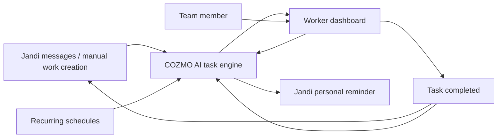
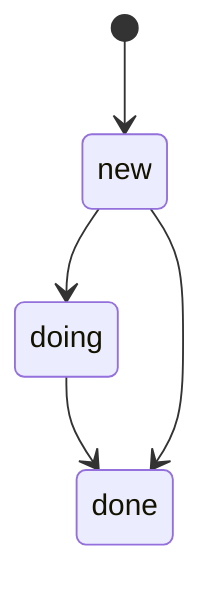

# Property Ops Dashboard — Working Spec

## Goal

Build a worker-facing dashboard for property operations. Each team member should open the dashboard, see the work they need to do, and update status as they work.

Jandi is the main intake channel today. Staff already use it to create work items manually, and COZMO AI will turn those messages and recurring schedules into actionable tasks.

## V1 Scope

- Worker dashboard for daily operations
- Jandi-connected task intake
- AI task creation and assignment
- Task lifecycle: `new`, `doing`, `done`
- Task sync back to Jandi
- AI reminder messages to workers if something is forgotten
- First supported work types:
  - Pest control
  - Plant watering

## Not In Scope For V1

- Finance dashboard
- CEO layer
- IoT automation
- Due time fields on task cards
- Advanced workflow states beyond `new`, `doing`, `done`

## Core Idea

The dashboard is not a place for staff to discover everything manually. It is a live execution surface.

1. A task is created from Jandi or from a recurring schedule.
2. COZMO AI decides the task type, property, and assignee.
3. The worker sees the task in the dashboard.
4. The worker moves it through `new` → `doing` → `done`.
5. The dashboard updates Jandi so the team has the same status in both places.
6. If a task is ignored, COZMO AI sends a personal reminder in Jandi.

## Mermaid Flow

## Task Lifecycle

## Data That Matters For V1

Each task should carry only what the worker needs to act.

- Property name
- Task type
- Notes
- Assignee
- Status
- Source channel
- Created time
- Last update

## Operating Rules

- Jandi stays the primary human input channel.
- AI can create tasks from recurring property routines.
- Workers can assign work to themselves.
- The dashboard shows active work first.
- Jandi must mirror the task state so no one needs to check two places.
- The first version should be simple and fast enough for repeated daily use.

## Rollout Plan

### Phase 1

Create the task model, dashboard list, and manual status updates for pest control and plant watering.

### Phase 2

Connect Jandi notifications so task creation, assignment, completion, and reminders are visible there too.

### Phase 3

Add recurring task generation for repeating property routines.

### Phase 4

Add IoT-linked operational tasks.

### Phase 5

Add a management layer for finance and higher-level reporting.

## Open Questions To Resolve Before Build

- Where should task data live long term?
- Should the dashboard be built inside `admin-ui` or as a new surface in the same app?
- How much AI autonomy should exist for assignment vs. worker self-assignment?
- What reminder rules count as "forgotten" for Jandi follow-up?

## Suggested Build Order

1. Finalize the task schema and dashboard layout.
2. Define the Jandi message format for task creation and reminders.
3. Build the worker task list and status controls.
4. Add recurring schedules for pest control and plant watering.
5. Add reminder automation.
6. Expand to IoT tasks after the first two workflows are stable.
