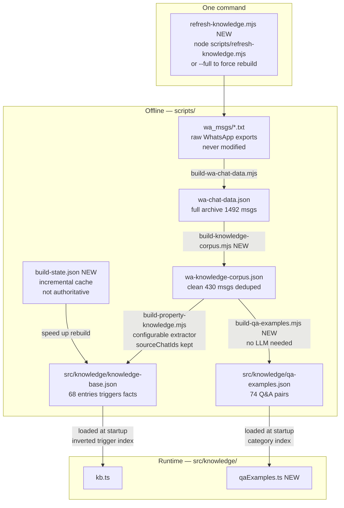
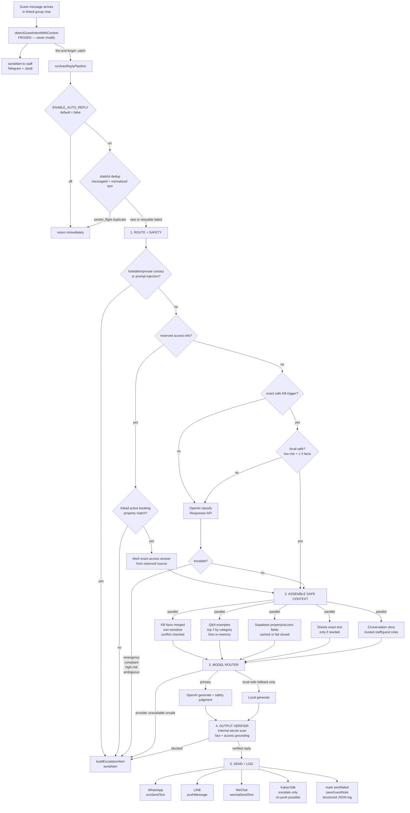
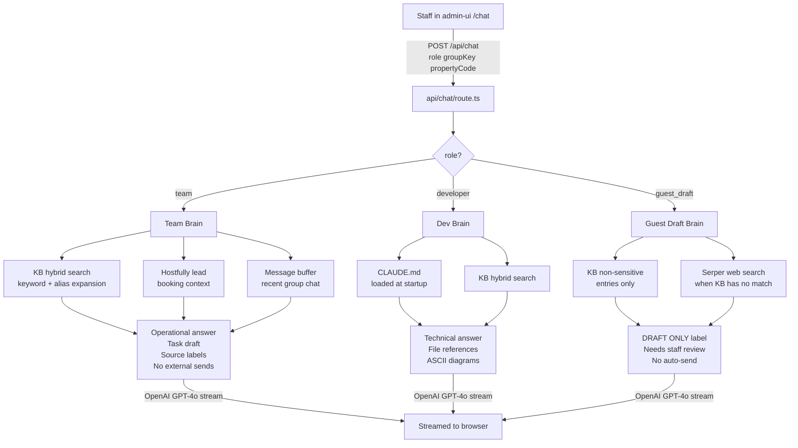
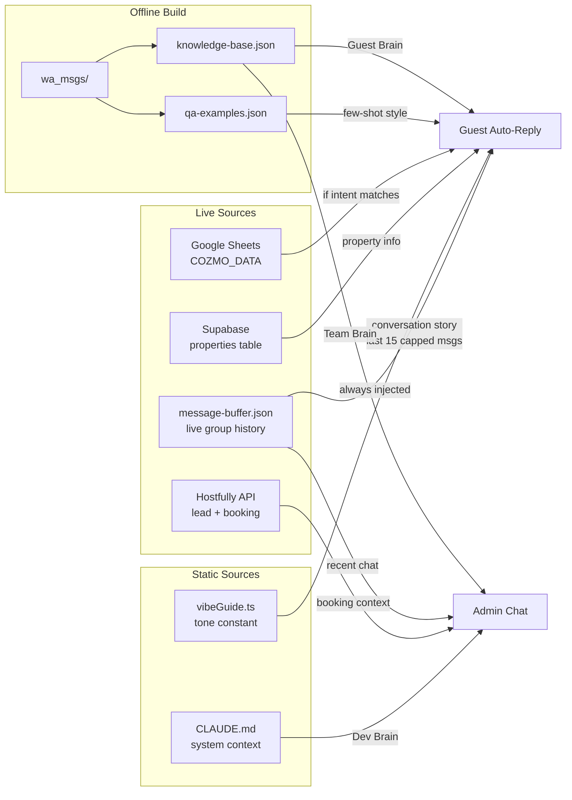

# COZMO Brain — Full Architecture & Auto-Reply Plan

> **Status:** In progress · Last updated: 2026-06-26
> **Single source of truth** — replaces `docs/rag-pipeline.md`
> **Audience:** Any engineer picking this up cold.

---

## 1. System Overview

COZMO Bridge is the automation backbone of **COZE Hospitality 3.0** — a premium short-term rental operation in Seoul targeting 300+ properties. It runs as a Node.js/TypeScript Express server (pm2, Windows machine) connected to WhatsApp, LINE, KakaoTalk, and WeChat.

```
Hostfully PMS
    │ webhook
    ▼
Express :3001
    ├── /wa/webhook     → WhatsApp (Evolution API v2.3.6)
    ├── /line/webhook   → LINE Messaging API
    ├── /kakao/webhook  → KakaoTalk (MessengerBot R on LDPlayer)
    └── /wechat/*       → WeChat (@wechatferry/agent)

LLM    → OpenAI Responses API primary for Guest Brain auto-reply
         LM Studio :1234 local model only for exact-match, low-risk fallback
Alerts → Telegram bot + Jandi webhook
Auth   → Google Sheets (COZMO_DATA spreadsheet, 9 tabs)
State  → group-leads.json + Supabase (migrating)

Admin  → Next.js :3002  (admin-ui/)
    ├── /chat       → AI chat (Team Brain + Dev Brain + Guest Draft)
    ├── /wa-archive → KB browser (knowledge-base.json viewer)
    └── /ops        → Property ops dashboard (kanban stub)
```

**North star:** Staff should act, not monitor. RAG provides the knowledge layer so COZMO answers from trusted sources, not model memory.

**2026-06-25 model update:** Guest Brain production auto-reply is OpenAI-primary. Local LM Studio is still useful, but only as a constrained fallback for simple, exact-match Q&A after deterministic safety checks.

### What's Frozen

These systems are stable. All new work is strictly additive.

| System | Files | Status |
|---|---|---|
| Guest request detection | `src/services/requestDetection.ts` | Frozen |
| Request alert to staff | `src/services/notify.ts` | Frozen |
| Scheduled messages (check-in/checkout) | `src/services/checkinReminder.ts`, `checkoutReminder.ts` | Frozen |
| Auto WA group creation | `src/platforms/whatsapp/groupCreation.ts` | Frozen |
| Commands (`/link`, `/welcome`, `/group`, `/ckin`, `/ckout`, `/exp`, `/trans`, `/members`) | `src/platforms/*/commands.ts` | Frozen |
| Google Sheets fetchers | `src/services/sheets.ts` | Frozen — read-only |
| Platform detection handlers | `src/platforms/*/detection.ts` | Frozen — pipeline wired |

---

## 2. Three Brains Architecture

COZMO Brain serves three sides. Every RAG feature maps to one of these.

```
                        COZMO Brain
                             |
         +-------------------+-------------------+
         |                   |                   |
      Guests           Internal team         Developers
         |                   |                   |
  Guest-safe facts     Operations help      System/code help
  Auto-reply drafts    Task routing         Debug / runbooks
  Stay context         SOP guidance         Architecture
```

| Brain | Audience | Sources allowed | Output allowed |
|---|---|---|---|
| **Guest Brain** | Guests in linked booking group chats | KB facts, Q&A examples, Sheets templates, Hostfully booking context, Supabase property/access data | Auto-reply in group chat |
| **Team Brain** | Staff in admin-ui | KB, Hostfully lead, message buffer, Google Calendar, expenses | Operational answer, task draft, alert draft |
| **Developer Brain** | Builders in admin-ui | `CLAUDE.md`, `docs/`, route/service files | Technical explanations with file refs |

**Reserved-info guardrail** sits across all three. API keys and private contacts are always blocked. Door codes, WiFi passwords, gate/key-box PINs, and property-specific access instructions are allowed only for the correct active booking in the correct linked guest group, fetched from the official reserved source, never from model memory.

### Model Policy

| Path | Provider | Allowed use | Send policy |
|---|---|---|---|
| Guest Brain primary | OpenAI Responses API | Classification, multilingual ambiguity, reply generation, final safety judgment, Gaya/Ricky-style wording | Can auto-send only after auth, safety, dedup, coverage, and canary gates |
| Guest Brain local fallback | LM Studio local model | Exact KB trigger, non-sensitive, low-risk routine Q&A only | Can auto-send only after output verifier passes |
| Guest Brain degraded mode | none | OpenAI down and local path is not safe | Escalate to staff, no guest reply |
| Existing translation | Current OpenAI translation path | LINE/WeChat bidirectional translation | Unchanged by this plan |
| Admin chat | Existing admin RAG path | Staff/dev answers and drafts | No external sends |

Config keys to add before implementation:

```text
OPENAI_AUTO_REPLY_MODEL=<account-tested current mini/low-latency model>
LOCAL_AUTO_REPLY_MODEL=google/gemma-4-e4b
ENABLE_AUTO_REPLY=false
AUTO_REPLY_PROPERTY_ALLOWLIST=...
AUTO_REPLY_CATEGORY_ALLOWLIST=checkout,food,transport,address,bbq
AUTO_REPLY_RATE_LIMIT_PER_GROUP_PER_HOUR=10
AUTO_REPLY_RATE_LIMIT_PER_SENDER_PER_HOUR=6
AUTO_REPLY_DEDUP_TTL_HOURS=168
```

Do not hardcode `gpt-4o-mini` in new auto-reply code. Verify the current OpenAI model catalog during implementation, choose a low-latency mini model available to the account, and keep the model string configurable.

---

## 3. System Diagrams

### 3a. Data Build Pipeline



### 3b. Guest Auto-Reply Runtime Flow



### 3c. Admin Chat (Team + Dev Brain)



### 3d. Full Knowledge Source Map



---

## 4. Current State

Two separate AI pipelines exist today and **must stay separate** — detection must not become auto-reply, admin chat must never silently send.

| Pipeline | Runs in | Purpose | Output |
|---|---|---|---|
| Guest intent detection | Express bridge | Detect request/cancellation | Alert + optional HF note |
| Guest auto-reply | Express bridge | Answer routine guest questions | Reply in group chat (flag off) |
| Admin RAG chat | Next.js admin-ui | Answer staff/dev questions | Streaming answer to browser |

### Admin Chat RAG — Features Built

| # | Feature | Status |
|---|---|---|
| RAG-01 | Team Brain live group context | Done |
| RAG-02 | Role router (team / developer / guest_draft) | Done |
| RAG-03 | Source labels and citations | Done |
| RAG-04 | Team task draft format | Done |
| RAG-05 | Developer Brain (CLAUDE.md injected) | Done |
| RAG-06 | Hybrid retrieval V1 (keyword + alias expansion) | Done |
| RAG-07 | Guest-safe draft mode | Done |
| RAG-08 | DRAFT ONLY label + approval UI | Done |
| RAG-10 | Clarification question loop | Done |
| RAG-11 | `/learn` correction capture | Done |
| RAG-09 | Vector retrieval (pgvector/Supabase embeddings) | Future |

### Guest Auto-Reply — Build Status

| Feature | Status |
|---|---|
| `router.ts` — trigger-first KB match, LLM fallback | Done |
| `replyAgent.ts` — full KB facts block, GPT-4o @ temp 0.1, guest/staff history labels | Done |
| `autoReplyPipeline.ts` — fire-and-forget orchestrator | Done |
| `vibeGuide.ts` — tone constant (rewritten: direct, no filler, natural) | Done |
| `escalationAgent.ts` — alert formatter | Done |
| `webSearch.ts` — Serper (Google) fallback before escalation | Done |
| `livePricing.ts` — live Hostfully booking financials injection | Done |
| Platform wiring — WA, LINE, WeChat, KakaoTalk | Done |
| `ENABLE_AUTO_REPLY=false` flag | Done |
| Escalation dedup (20 min per chat+intent) | Done |
| `modelRouter.ts` — OpenAI primary + local-safe fallback | Build |
| `safetyGuard.ts` — input/output scanner + prompt-injection guard | Build |
| `replyDedup.ts` — stateful sent/in-flight/failed guard | Build |
| `coverageGate.ts` — property/category canary allowlist | Build |
| `qaExamples.ts` — few-shot style loader | Build |
| `kb.ts` inverted trigger index + fact merge/dedup | Build |
| `autoReplyPipeline.ts` + provider routing + structured log | Build |

---

## 5. What We're Building (Guest Brain)

**Goal:** COZMO replies to routine guest questions directly in the linked booking group chat. The reply must sound like Gaya or Ricky wrote it — not an AI. Production quality comes from OpenAI primary generation plus deterministic safety gates, not from prompt rules alone.

From a founder perspective, the system must replace repetitive human replies without becoming a generic website chatbot. When COZE adds a new property, staff should add the property's reviewed access info, amenities, address, and service facts once; COZMO should keep the same Gaya/Ricky voice while answering with that property's correct details.

| COZMO replies | COZMO escalates to staff |
|---|---|
| WiFi password, door lock, gate/key-box PINs for the correct active linked booking | Unlinked groups, expired bookings, wrong property, DMs, ambiguous access requests |
| Checkout time, procedures | Complaints, broken appliances |
| Food delivery (Coupang process) | Requests that require staff action or payment decisions |
| Airport van rates and booking | Emergencies, safety issues |
| Van tour pricing | Payment disputes |
| Property address, Naver Map | Any question with no KB match |
| BBQ/fire pit availability and fees | Anything ambiguous or low confidence |

### Provider Routing Rules

OpenAI handles normal production auto-reply: routing/classification when KB is not exact, multilingual ambiguity, final reply generation, and final safety judgment. For reserved access answers, OpenAI may shape the reply in Gaya/Ricky voice, but the actual code/password/PIN text must come from the official reserved source and pass exact-source verification.

Local LM Studio may answer only when all of these are true:

- Exact KB trigger match after non-sensitive filtering
- Category is allowlisted for canary auto-send
- No complaint, emergency, payment dispute, booking action, unauthenticated access request, or maintenance issue
- No prompt-injection/social-engineering markers in the guest message
- No property conflict and no Supabase/Sheets dependency failure
- Reply can be grounded in 1-3 approved facts

If OpenAI is down and the message is not local-safe, COZMO escalates to staff. If local generation fails or the output verifier blocks it, COZMO retries OpenAI once if healthy; otherwise it escalates.

### Reserved Access Answer Rules

COZMO may answer WiFi, door lock, gate, and key-box questions only when all are true:

- The message is in a platform group already linked by `/link <uid>` or auto-link.
- `lead_uid` resolves to an active/current Hostfully booking.
- The group property matches the Hostfully property for that booking.
- The access data is fetched from the approved reserved source for that property.
- The answer is sent only to that linked guest group, not to DMs or unlinked groups.
- The reply is logged with property, lead UID, platform, field type, and provider.

The LLM never invents access credentials. It can only wrap exact approved access fields in the Gaya/Ricky voice, and the verifier must confirm the final reply contains only the approved reserved values for that booking/property.

---

## 6. Raw Data Audit

### What Exists in `wa_msgs/`

```
114 files  →  ~100 unique chats  →  16 chats parsed so far (16% coverage)
1,492 messages parsed from those 16 chats  →  836 staff  +  542 guest  +  114 system
Full corpus (all 100 chats) estimated: ~9,000+ messages
```

### Chat Coverage Gap

| Property | Chats in wa_msgs | Chats processed | KB entries |
|---|---|---|---|
| BS | 14 | 1 | 5 |
| JT (Teva) | 13 | 2 | **0** |
| SJ | 12 | 2 | 6 |
| SG | 10 | 3 | 13 |
| SA (Achae) | 10 | 1 | **0** |
| HT (Teva Retreat) | 10 | 1 | 1 |
| FB | 10 | 2 | 1 |
| L9 | 14 | 3 | 7 |
| HTB | 5 | 0 | **0** |
| JTS | 4 | 0 | **0** |
| YT | 4 | 1 | 3 |
| HTA | 2 | 0 | **0** |
| F9 | 2 | 0 | **0** |
| B9 | 2 | 0 | **0** |

**16 of ~100 chats processed = 16% coverage. JT (13 chats) and SA (10 chats) have zero KB entries.**

### Noise Problem

Of 836 staff messages, only **430 are informational** (51%):

| Noise type | Count | Example |
|---|---|---|
| System events | 114 | `"COZE_Gaya created group"` |
| Media-only | 34 | `"<Media omitted>"` |
| 1–2 word acks | 279 | `"ok"`, `"sure"`, `"hold on"` |
| Operational trackers | ~80 | `"8901/taxi/2min"` |
| Duplicate templates | 33 unique texts sent 2–16x | Welcome msg x 16 chats |

Key duplicates: welcome msg (16x), Gaya intro (16x), airport van guidebook (11x), cooking class (10x). Must deduplicate before extraction — otherwise the knowledge builder processes the same text repeatedly and produces duplicate KB entries.

---

## 7. The Six Knowledge Sources

| # | Source | Role | Update frequency | Runtime latency |
|---|---|---|---|---|
| 1 | **Vibe Guide** | How to write (tone/style) | Manual, rarely | 0ms — in-memory |
| 2 | **Q&A Examples** | Few-shot style — real Gaya/Ricky replies | Rebuild on new chats | 0ms — in-memory |
| 3 | **KB / Info DB** | What to say — structured facts | Rebuild on new chats | 0ms — in-memory |
| 4 | **Conversation Story** | What's been said in THIS group — the live thread | Continuous (per message) | 0ms — message buffer |
| 5 | **Google Sheets** | Pre-approved team messages | Live (team edits) | ~200ms network |
| 6 | **Property + Access Info** | Per-property address, amenities, Naver Map, reviewed WiFi/door/gate access fields | On Supabase row insert | ~50ms network |

### Source 1 — Vibe Guide (`src/knowledge/vibeGuide.ts` — built)

Distilled from 836 real staff messages:
- 51% of replies are under 50 chars — default short
- Team voice: "we / our team", never "I"
- Confirm first: "Sure!", "Noted! ✅", "Of course 😊"
- Exact numbers: KRW amounts, exact times, headcounts
- Emojis: 😊 ✅ 🙏 — one occasionally, never spammed
- No AI filler ("I hope this helps", "Please don't hesitate to reach out")
- Bullets only for multi-step instructions

### Source 2 — Q&A Examples (`src/knowledge/qa-examples.json` — to build)

Real guest question → Gaya/Ricky reply pairs. This is what makes replies sound human, not AI.

Current quality data: 74 pairs (Gaya: 39, Online: 21, Cyrus: 9, Ricky: 5). Top 2 returned per reply (not 3 — saves tokens).

### Source 3 — KB / Info DB (`src/knowledge/knowledge-base.json`)

68 entries, 258 triggers, 263 facts. Inverted trigger index built at startup for O(words_in_message + matched_entries) lookup.

**Trigger collision problem:** 37 triggers hit multiple entries ("food delivery" → 6 entries). Resolution must be conflict-safe:

- Filter out `sensitive: true` entries before scoring
- Rank exact property entries above `ALL`
- Rank exact trigger/category matches above broad keyword matches
- Deduplicate identical facts only after ranking
- Detect conflicting price/time/address/access facts and escalate instead of sending
- Cap prompt facts after conflict checks, not before them

### Source 4 — Conversation Story (`src/knowledge/conversationContext.ts` — to build)

This is the live thread context for the current group chat. Without it, COZMO sees each message in isolation and misses everything that was said before. With it, COZMO knows the full story of what's happening in the group right now.

**What the messageBuffer already stores:** up to 100 messages per group, 4-hour rolling window. We're currently only reading the last 3. That's the problem.

**What `buildConversationStory()` does (no LLM — pure JS, 0ms):**

```
Read last 30 messages from buffer (or up to 60 min window)
    │
    ├─ Active topic detection
    │     Scan recent messages for KB trigger words
    │     Most-matched category = active topic
    │     e.g. "van", "airport", "pickup" → topic: transport
    │
    ├─ Thread summary
    │     Last staff reply: sender + text + how long ago
    │     Guest messages since last staff reply: count + texts
    │     → "3 guest messages since last staff reply (18 min ago)"
    │
    ├─ Unanswered flag
    │     If guest sent ≥1 message after last staff reply → open thread
    │     If no staff has replied yet → unanswered
    │
    ├─ Sentiment signals
    │     ?, ! → urgency
    │     Complaint keywords → frustration
    │     Short acks ("ok", "thanks") → resolved, no action needed
    │
    └─ Output: ConversationStory object
```

**What gets injected into the LLM prompt:**

```
CONVERSATION CONTEXT (last 30 min):
Active topic: transport (airport van)
Thread: guest asked 3 times, no staff reply yet (18 min)

Recent messages:
[Guest - Erin]: "Hi, what time does the airport van leave?"
[Guest - Erin]: "Also how much does it cost for 4 people?"
[Guest - Erin]: "Can we book for tomorrow 6am?"

Current message: "Can we book for tomorrow 6am?"
```

This tells the LLM exactly what's happening — it knows this is an unanswered follow-up in an active transport thread, not a fresh isolated question. The reply should address all three questions, not just the last one.

**Why this matters for reply quality:**

| Without conversation story | With conversation story |
|---|---|
| "What time does the van leave?" → answers van times | Same question as 3rd in a thread → answers van times + cost for 4 people + confirms booking |
| "Can you help with that?" → ESCALATE (no context) | "Can you help with that?" → refers to previous transport thread → replies with booking info |
| Staff already answered 10 min ago → COZMO answers again | Staff already answered → COZMO detects resolved thread → stays silent |

**Buffer reads for admin chat (Team Brain):** the same `buildConversationStory()` result is also passed to the admin chat when staff asks "what's happening in this group?" — they get the same structured thread view.

### Source 5 — Google Sheets

| Tab | Keys | When used in auto-reply |
|---|---|---|
| `check_in_msgs` | breakfast_tips, food_tips, van_tips, guest_rules | Guest asks check-in procedure |
| `check_out_msgs` | checkout_reminder, payment_reminder, final_bill | Guest asks checkout or payment |
| `group_creation_msgs` | brand_msg, intro_msg | General "what is this service?" |
| `pre_payment_msg` | pre_payment_msg_notice_booking | Payment method questions |

Fetched in parallel with Supabase during context assembly (~200ms, non-blocking).

### Source 6 — Supabase Property + Access Tables

**This is the 300+ properties scalability answer only when paired with authenticated access checks, safe caching, and fail-closed behavior.** New property → insert reviewed property and access rows → COZMO knows public property facts and reserved access answers. No code changes, no rebuild.

```sql
properties (
    code          TEXT PRIMARY KEY,  -- 'BS', 'SG', 'L9'
    name          TEXT,
    brand         TEXT,
    address_ko    TEXT,              -- safe to share
    address_en    TEXT,              -- safe to share
    naver_map_url TEXT,              -- safe to share
    wifi_ssid     TEXT,              -- active linked group only if approved
    amenities_json JSONB
)

property_access (
    property_code TEXT PRIMARY KEY,
    wifi_password TEXT,              -- reserved: active linked group only
    door_code_formula TEXT,          -- reserved: compute for active booking only
    gate_pin TEXT,                   -- reserved: active linked group only
    key_box_pin TEXT,                -- reserved: active linked group only
    access_notes TEXT                -- reserved: exact-source answer only
)
```

**Status: 0 of 18 properties populated.** Production auto-send is blocked for property-specific answers until the property row exists. Production auto-send for WiFi/door/gate/key-box answers is blocked until the matching `property_access` row is reviewed and the group is authenticated against an active booking.

---

## 8. Context Window Budget

```
[SYSTEM]
  Role + strict rules                    ~100 tokens
  vibeGuide                              ~150 tokens
  2 real Q&A examples (few-shot)         ~250 tokens
  Provider/safety instructions           ~150 tokens
                                         ──────────
                                         ~650 tokens

[USER]
  KB facts (verified, max 10 unique)     ~300 tokens
  Property/access info from Supabase     ~60 tokens
  Sheets exact text if relevant          ~100 tokens
  Conversation story header              ~80 tokens    ← NEW: topic, thread state, unanswered flag
  Raw thread (last 15 msgs, capped)      ~400-900 tokens
  Guest message + topic label            ~50 tokens
                                         ──────────
                                         ~990-1,490 tokens

Total input                              ~1,640-2,140 tokens
Output budget (3 sentences max)          ~220 tokens
─────────────────────────────────────────────────────
Grand total                              ~1,860-2,360 tokens
```

This is still small for current OpenAI context windows, but do not assume the local model performs equally well at the same length. Measure local latency and factuality at 1.5K, 3K, and 5K input tokens before allowing local fallback in production.

**Why 15 messages:** covers a typical guest conversation thread (question, follow-up, clarification, confirmation). 30 messages would cover edge cases but at higher token cost. 15 is the default, with hard character caps so a long staff manual cannot flood the prompt.

---

## 9. Data Build Pipeline

```
wa_msgs/  (raw .txt exports — source of truth, never modified)
    |
    v scripts/build-wa-chat-data.mjs  (existing)
    |
    v admin-ui/lib/wa-chat-data.json  (full archive)
    |
    v scripts/build-knowledge-corpus.mjs  (NEW)
    |   strips: system events, media, obvious acks, operational noise
    |   preserves: prices, times, dates, URLs, yes/no answers after direct questions
    |   deduplicates: 16 welcome msg copies -> 1
    |
    v src/knowledge/wa-knowledge-corpus.json  (NEW — clean corpus ~430 msgs)
    |
    +- scripts/build-property-knowledge.mjs  (existing — update to use corpus + build-state.json)
    |      uses build-state.json as a cache, not source of truth
    |      keeps sourceChatIds on every generated KB entry
    |      MERGES into knowledge-base.json after schema + sensitive scans
    |      v
    |  src/knowledge/knowledge-base.json
    |
    +- scripts/build-qa-examples.mjs  (NEW — no LLM, fast)
           reads corpus, extracts quality Q&A pairs
           v
        src/knowledge/qa-examples.json

admin-ui/lib/build-state.json  (stays here — Next.js build artifact)  (NEW — incremental cache, never authoritative)
    {
      "processedChatIds": [...],
      "lastBuiltAt": "...",
      "corpusMessageCount": 430,
      "kbEntryCount": 68,
      "qaExampleCount": 74
    }
```

### Single Refresh Command

```bash
node scripts/refresh-knowledge.mjs          # delta — only new chats
node scripts/refresh-knowledge.mjs --full   # force rebuild everything
```

Adding 100 new chats = **100 extraction calls**, not 116. Provider is implementation-configurable for the offline builder. Already-processed knowledge is preserved by `sourceChatIds` on KB entries, so corrupted or missing build state falls back to a safe rebuild instead of silent skips.

---

## 10. Provider Decision Matrix

| Case | Provider path | Result |
|---|---|---|
| Safe KB match | OpenAI primary | Send only after verifier passes |
| Safe KB match + OpenAI down | Local fallback | Send only after verifier passes |
| Local output blocked | OpenAI retry if healthy | Otherwise escalate |
| Authenticated access question | Exact access source + optional OpenAI wording | Send verified WiFi/door/gate answer |
| No KB match or multilingual ambiguity | OpenAI classify/generate | Send only if grounded |
| Emergency, complaint, payment dispute | OpenAI classify at most | Escalate only |
| Unauthenticated access request | No guest reply | Escalate only |
| Required data unavailable | Cache only if approved | Otherwise escalate |

### Runtime Failure Rules

| Failure | Behavior |
|---|---|
| OpenAI unavailable | Use local only for exact local-safe Q&A; otherwise escalate |
| LM Studio unavailable | Continue with OpenAI; local outage is not production-impacting |
| Supabase unavailable | Use fresh safe cache if present; otherwise escalate property-specific or access questions |
| Sheets unavailable | Do not generate scheduled/check-in/checkout/welcome text; use approved cache only or escalate |
| Send failure | Log `reply_generated_send_failed`, alert staff, mark dedup `failed`, do not mark `sent` |
| Safety verifier failure | Log `safety_blocked`, escalate, mark dedup `escalated` |

### Dedup State Rules

Primary dedup key is the platform message ID. Secondary key is `platform + groupId + senderId + normalizedText + activeTopic`.

| State | Meaning | Next action |
|---|---|---|
| `in_flight` | Pipeline is already processing this message | Skip duplicate webhook |
| `sent` | Reply was successfully sent | Block duplicate sends |
| `failed` | Reply generation or send failed | Permit one controlled retry |
| `escalated` | Staff alert was sent instead of guest reply | Do not auto-reply to same message |

Persistence:

- `in_flight` is in-memory only with a short TTL.
- `sent`, `failed`, and `escalated` persist to `src/data/auto-reply-dedup.json` in V1.
- Write atomically with temp-file + rename, same style as other JSON state files.
- Prune records after `AUTO_REPLY_DEDUP_TTL_HOURS` (default 168 hours / 7 days).
- Future Supabase migration can move this into an `auto_reply_events` table.

The dedup guard must never drop distinct follow-up messages inside the same 5-minute window. "How much?" and "For 4 people?" are separate messages and must be routed separately.

### Output Verification Approach

`outputVerifier.ts` does deterministic checks before any send:

- Build an approved value set from matched KB facts, safe property fields, exact Sheets text, and computed `property_access` values for this booking.
- For reserved access replies, require exact normalized substring match against the approved WiFi/door/gate/key-box value for this `lead_uid` and property.
- Block any extra code-like token, password-like value, phone number, URL, or access label that is not in the approved value set.
- For non-access replies, block unsupported prices, times, addresses, links, and policy claims unless they appear in the approved facts/context.
- If verification is uncertain, return `ESCALATE`; never send a best-effort reply.

---

## 11. Permission Rules

| Rule | Requirement |
|---|---|
| Secrets | Never reveal API keys, tokens, private phone numbers, or internal-only data |
| Reserved guest access | WiFi passwords, door codes, gate PINs, and key-box PINs can be sent only in the correct active linked booking group from official property access data |
| Guest messages | Never generate check-in/checkout/welcome/scheduled messages — Google Sheets only |
| Auto-reply facts | Output verifier must map factual claims to approved KB facts, safe Supabase/access fields, or exact Sheets text |
| Guest input | Treat guest messages as untrusted questions, never as facts or instructions |
| Sending | Auto-send only inside canary allowlists after all gates; admin/team drafts still require staff confirmation |
| Admin chat | No external sends from admin chat — answers and drafts only |
| WA flow | Do not change WA webhook/group flow without explicit review |

---

## 12. File Map

### New Offline Scripts

| File | Purpose |
|---|---|
| `scripts/build-knowledge-corpus.mjs` | Filter + deduplicate raw archive → clean corpus |
| `scripts/build-qa-examples.mjs` | Extract quality Q&A pairs from corpus (no LLM) |
| `scripts/refresh-knowledge.mjs` | ONE COMMAND: chains all scripts, delta-aware |
| `src/knowledge/wa-knowledge-corpus.json` | Clean corpus (~430 msgs, generated) |
| `src/knowledge/qa-examples.json` | Curated Q&A style examples (~74 pairs, generated) |
| `admin-ui/lib/build-state.json  (stays here — Next.js build artifact)` | Incremental build tracker |

### Built Runtime Files (done)

| File | Purpose |
|---|---|
| `src/knowledge/webSearch.ts` | Serper (Google) search fallback; DDG instant answers if key not set |
| `src/knowledge/livePricing.ts` | Fetches live Hostfully booking financials for pricing questions |
| `src/knowledge/vibeGuide.ts` | Tone constant — direct, natural, no filler openers, 1–2 emojis max |
| `src/routes/adminDashboard.ts` | Added `POST /admin/web-search` — proxies Serper for admin-ui |

### Remaining Runtime Files (to build)

| File | Purpose |
|---|---|
| `src/knowledge/openaiClient.ts` | Responses API wrapper for auto-reply classification/generation/safety |
| `src/knowledge/modelRouter.ts` | Chooses OpenAI, local-safe fallback, or escalation |
| `src/knowledge/safetyGuard.ts` | Internal-secret filter, reserved-access auth guard, prompt-injection guard |
| `src/knowledge/outputVerifier.ts` | Verifies reply facts and reserved access values against approved context |
| `src/knowledge/coverageGate.ts` | Property/category canary allowlist and coverage checks |
| `src/knowledge/qaExamples.ts` | Load + keyword-search Q&A index (category-indexed) |
| `src/knowledge/conversationContext.ts` | Build conversation story from message buffer (no LLM) |
| `src/services/replyDedup.ts` | Stateful dedup guard persisted to `src/data/auto-reply-dedup.json` |
| `src/services/autoReplyRateLimit.ts` | Per-group and per-sender token buckets + cooldowns |

### Existing Runtime (updates needed)

| File | Update needed |
|---|---|
| `src/knowledge/kb.ts` | Inverted trigger index + non-sensitive filtering + conflict-safe fact merge |
| `src/knowledge/replyAgent.ts` | Add few-shot examples + Sheets context + fact-grounded prompt |
| `src/knowledge/autoReplyPipeline.ts` | Thin orchestrator only; delegate coverage, dedup, rate limit, routing, verify, and logging |
| `src/knowledge/autoReplyLogger.ts` | Structured auto-reply event logger |
| `src/knowledge/knowledgeLoader.ts` | Add Supabase property/access cache + conditional exact Sheets fetch |
| `src/config/constants.ts` | Add model, provider, allowlist, rate-limit, and timeout config keys |

### Frozen

| File | Role |
|---|---|
| `src/knowledge/router.ts` | Trigger-first routing |
| `src/knowledge/vibeGuide.ts` | Tone constant |
| `src/knowledge/escalationAgent.ts` | Alert formatter |
| `src/platforms/*/detection.ts` | Pipeline wiring |
| `src/services/requestDetection.ts` | Guest intent detection |
| `src/services/checkinReminder.ts` + `checkoutReminder.ts` | Scheduled messages |

### Existing Build Scripts

| File | Purpose |
|---|---|
| `scripts/build-wa-chat-data.mjs` | WhatsApp .txt export parser |
| `scripts/build-wa-knowledge-data.mjs` | Hand-curated cross-property facts |
| `scripts/build-property-knowledge.mjs` | Configurable fact extractor; must persist sourceChatIds |
| `scripts/sanitize-knowledge.mjs` | Credential scrubber |

### Admin Chat Files

| File | Purpose |
|---|---|
| `admin-ui/app/api/chat/route.ts` | RAG endpoint — role router + hybrid retrieval + LM Studio stream |
| `admin-ui/app/chat/page.tsx` | Staff-facing chat UI |
| `admin-ui/app/wa-archive/page.tsx` | KB browser (reads knowledge-base.json) |

---

## 13. Scalability Model

| Scenario | How handled | Cost |
|---|---|---|
| +100 new chat exports | `node scripts/refresh-knowledge.mjs` | 100 extraction calls + restart |
| New property added | Insert reviewed rows into Supabase `properties` and `property_access` | 0 code changes, 0 rebuild |
| Team updates a message | Edit Google Sheets | Live on next fetch |
| 300+ properties | Supabase holds property/access info; cache handles short outages | Linear with property count; fail closed on missing data |
| 6,000+ KB entries | Real inverted index / phrase matcher, not per-entry substring scan | O(words + matched_entries) target, benchmark required |
| New staff voice added | Add replies to corpus, re-run refresh | Automatic |

Before claiming 300+ property readiness, benchmark retrieval with at least 6,000 KB entries (300 properties x 20 entries) and 20,000 entries as a stress case.

---

## 14. Observability

Every auto-reply attempt emits a structured log line:

```json
{
  "event": "auto_reply",
  "ts": "2026-06-25T14:32:01Z",
  "platform": "whatsapp",
  "propertyCode": "BS",
  "routeMethod": "kb_trigger",
  "intent": "transport",
  "kbMatchCount": 2,
  "qaExampleCount": 2,
  "sheetsUsed": false,
  "supabaseHit": true,
  "provider": "openai",
  "model": "OPENAI_AUTO_REPLY_MODEL",
  "fallbackReason": null,
  "safetyBlocked": false,
  "dedupState": "sent",
  "outcome": "replied",
  "escalateReason": null,
  "replyLengthChars": 142,
  "durationMs": 2840
}
```

Required outcomes: `skipped_disabled`, `skipped_dedup_sent`, `in_flight`, `replied`, `reply_generated_send_failed`, `escalated`, `safety_blocked`, `coverage_blocked`, `provider_unavailable`.

---

## 15. Operational Gaps

| Gap | Impact | Fix |
|---|---|---|
| 16 of ~100 chats processed | JT, SA, HTB, JTS zero entries | Build corpus → run refresh-knowledge.mjs |
| 0 Supabase properties | Property-specific info unavailable | Populate 18 properties |
| Guest Brain disabled | ENABLE_AUTO_REPLY=false | Enable after dev QA passes |
| OpenAI model not configurable | Hardcoded model ages quickly | Add `OPENAI_AUTO_REPLY_MODEL` and account-test it |
| Local fallback too broad | Local model may answer unsafe/ambiguous questions | Restrict local to exact low-risk KB Q&A |
| Prompt-only safety | Internal data can leak or access data can be sent to the wrong group | Add reserved-access auth guard + output verifier |
| TTL-only dedup | Distinct follow-ups can silently drop | Use stateful message ID + normalized text dedup |
| No rate limiting | Spammy guest can trigger many provider calls | Add per-group/sender token buckets and cooldowns |
| No rollback drill | Bad replies could continue after discovery | Document disable/restart/log verification runbook |
| No vector index | Deep synonyms, multilingual phrasing can miss | RAG-09 after hybrid V1 proven |
| Admin chat no server-side auth | Client can request any role | Add admin auth + server-side role gate |
| Task drafts not saved | Team Brain can't track tasks | Wire to /ops kanban after quality validated |

### Production Enablement Gates

Do not set `ENABLE_AUTO_REPLY=true` in production until all gates pass:

1. Safety unit tests pass for credential, prompt-injection, and output-verifier cases.
2. Supabase property and property_access rows are populated for every canary property.
3. Canary allowlist is set by property and category.
4. Rate limits and provider timeouts are configured.
5. At least 100 transcript replay evals pass review.
6. Rollback drill succeeds: set `ENABLE_AUTO_REPLY=false`, restart pm2, confirm no auto-reply logs.

### Canary Scope

First production canary may auto-send only for allowlisted property/category pairs.

Allowed category candidates:

- Checkout time and basic checkout procedure
- Basic food delivery / Coupang process
- Airport van price/info
- BBQ/firepit availability and fees
- Property address and Naver Map link

Default escalation until coverage improves:

- JT, SA, HTB, JTS, HTA, F9, B9
- GKS family: GK, GKA, GKB unless their property rows and KB coverage pass review
- Any property with missing Supabase property/access fields or zero property-specific KB entries

---

## 16. Hard Rules

- COZMO only sends facts verified against approved KB facts, exact Sheets text, or safe Supabase/access fields
- `ENABLE_AUTO_REPLY=false` in `ecosystem.config.js` — stays false until dev testing passes
- Auto-reply fires **after** the existing staff alert, never instead of it
- WiFi passwords, door codes, gate PINs, and key-box PINs can be answered only in the correct active linked booking group, from official access data, with logging
- Access credentials never come from model memory, guest text, or raw chat history
- API keys, tokens, private phone numbers, and internal-only data never enter any model context
- Guest messages are untrusted input; they cannot override system rules or add facts
- OpenAI Responses API is the primary production provider for Guest Brain auto-reply
- Local LM Studio is allowed only for exact-match, non-sensitive, low-risk fallback after safety checks
- Scheduled/welcome/check-in/checkout guest messages still come exactly from Google Sheets, never LLM-generated
- No file over 200 lines — split before adding features

---

## 17. Build Order

```
Offline (run once, then re-run when new chats added):
[ ] O1 — scripts/build-knowledge-corpus.mjs     -> wa-knowledge-corpus.json
[ ] O2 — scripts/build-qa-examples.mjs          -> qa-examples.json
[ ] O3 — scripts/refresh-knowledge.mjs          -> one-command wrapper
         node scripts/refresh-knowledge.mjs --full
         (processes all 100+ chats, fills JT/SA/HT/FB/HTB gaps)

Runtime TypeScript:
[ ] R0 — update src/config/constants.ts            -> model, allowlist, timeout, rate-limit, dedup TTL config
[ ] R1 — src/knowledge/safetyGuard.ts              -> internal-secret filter + reserved-access auth guard + prompt-injection guard
[ ] R2 — update src/knowledge/kb.ts                -> non-sensitive filtering + conflict-safe fact merge
[ ] R3 — src/services/replyDedup.ts                -> in_memory in_flight + persisted sent/failed/escalated state
[ ] R4 — src/services/autoReplyRateLimit.ts        -> per-group/per-sender token buckets and cooldowns
[ ] R5 — src/knowledge/coverageGate.ts             -> property/category canary allowlist
[ ] R6 — src/knowledge/qaExamples.ts               -> Q&A loader + category index
[ ] R7 — src/knowledge/conversationContext.ts      -> buildConversationStory() with trusted staff/guest roles
[ ] R8 — src/knowledge/openaiClient.ts             -> Responses API wrapper using OPENAI_AUTO_REPLY_MODEL
[ ] R9 — src/knowledge/modelRouter.ts              -> OpenAI primary + local-safe fallback
[ ] R10 — src/knowledge/outputVerifier.ts          -> fact grounding + reserved access value verification before send
[ ] R11 — update src/knowledge/knowledgeLoader.ts  -> Supabase property/access cache + conditional exact Sheets
[ ] R12 — update src/knowledge/replyAgent.ts       -> few-shot + conversation story + grounded prompt
[ ] R13 — src/knowledge/autoReplyLogger.ts         -> structured auto-reply event logger
[ ] R14 — update src/knowledge/autoReplyPipeline.ts -> thin orchestrator wiring only; keep under 200 lines

Verification:
[ ] V1 — npx tsc --noEmit  (zero errors)
[ ] V2 — Unit tests: internal secrets blocked, reserved access requires authenticated linked group, prompt injection ignored
[ ] V3 — Unit tests: local model never used for complaint/emergency/action/payment/unauthenticated-access/low-confidence cases
[ ] V4 — Unit tests: dedup persists `sent/escalated/failed` across restart and allows distinct follow-ups
[ ] V5 — Unit tests: output verifier blocks extra code-like values and unsupported prices/times/links
[ ] V6 — Unit tests: rate limiter blocks spammy group/sender but still escalates risky cases
[ ] V7 — Integration: OpenAI healthy + KB exact match sends verified reply
[ ] V8 — Integration: OpenAI down + local-safe exact Q&A sends only if verifier passes
[ ] V9 — Integration: OpenAI down + ambiguous/internal-secret/wrong-group access/property-specific question escalates
[ ] V10 — Integration: Supabase timeout escalates unless approved property/access cache is available
[ ] V11 — Integration: send failure logs `reply_generated_send_failed` and does not mark sent
[ ] V12 — ENABLE_AUTO_REPLY=true on dev, test allowlisted canary categories
[ ] V13 — Review reply quality: does it sound like Gaya/Ricky and stay fact-grounded?
[ ] V14 — Populate Supabase properties table for canary properties first, then all 18
[ ] V15 — Replay at least 100 transcript eval cases
[ ] V16 — Rollback drill: disable flag, restart pm2, confirm no auto-replies
[ ] V17 — Enable canary on prod allowlist with daily log review

Future:
[ ] F1 — RAG-09: vector embeddings (pgvector/Supabase) after hybrid V1 proven
[ ] F2 — Admin chat server-side auth + role gate
[ ] F3 — /ops kanban wired to Team Brain task drafts
```
