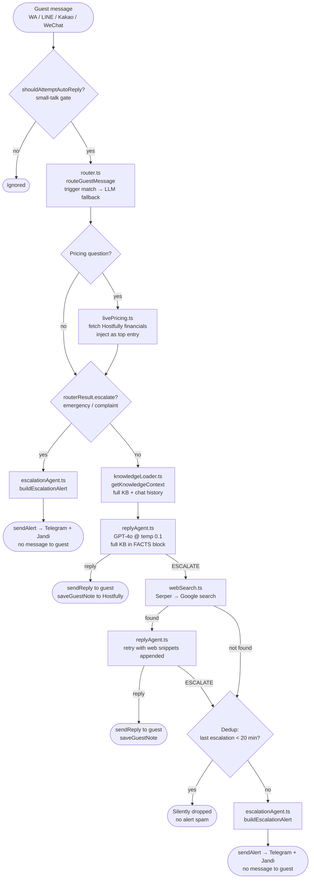

# Auto-Reply Pipeline — `src/knowledge/`

## Live Guest Reply Flow (bridge)



## Admin-UI Draft Flow (guest_draft / guest_sim modes)

```mermaid
flowchart TD
    A([Staff pastes guest message\nin Admin Chat]) --> B[searchKB\nkeyword + semantic match]

    B -- matches found --> C[GPT-4o\nwith KB facts]
    B -- no matches --> D[POST /admin/web-search\nbridge proxies Serper]

    D -- found --> E[GPT-4o\nwith web snippets]
    D -- not found --> F[GPT-4o\nno facts — says team will check]

    C --> G([Draft shown to staff\nDRAFT ONLY — needs review])
    E --> G
    F --> G
```



> The admin-ui never calls Serper directly — it proxies through the bridge's
> `POST /admin/web-search` endpoint so the Serper API key stays in one place
> (`ecosystem.config.js`).

## Files

| File | Role |
|---|---|
| `autoReplyPipeline.ts` | Orchestrator — calls every step in order |
| `router.ts` | Intent detection: trigger-first KB match, then Gemma 4 fallback |
| `kb.ts` | KB loader + `searchKBEntries()` + `getPropertyEntries()` |
| `knowledge-base.json` | Canonical KB — single source of truth for all platforms |
| `knowledgeLoader.ts` | Builds `KnowledgeContext`: property KB entries + labeled chat history |
| `replyAgent.ts` | GPT-4o caller — full KB as FACTS block, `vibeGuide` as tone rules |
| `vibeGuide.ts` | Tone instructions: direct, natural, no filler, 1–2 emojis max |
| `livePricing.ts` | Fetches actual booking financials from Hostfully API for pricing Qs |
| `escalationAgent.ts` | Builds the staff alert format (no text sent to guest) |
| `webSearch.ts` | Serper (Google) search fallback; DDG instant answers if key not set |
| `wa-chat-data.json` | Raw WhatsApp chat archive (input to KB build) |
| `wa-knowledge-corpus.json` | Cleaned message corpus (output of build-wa-knowledge-data) |
| `wa-knowledge-data.json` | Hand-curated KB seeds |
| `qa-examples.json` | Q&A pairs extracted from chats (used to enrich KB) |

## Web Search (Serper)

| Config | Value |
|---|---|
| Key env var | `SERPER_API_KEY` in `ecosystem.config.js` |
| Free credits | 2,500 one-time (serper.dev) |
| Endpoint | `POST https://google.serper.dev/search` |
| Used by | `webSearch.ts` (bridge live replies) + `/admin/web-search` (admin-ui drafts) |
| Fallback | DDG Instant Answers if `SERPER_API_KEY` is empty |

## KB Build Pipeline (offline scripts)

```
wa-chat-data.json
    │
    └─► scripts/build-wa-knowledge-data.mjs
            │
            ├─► wa-knowledge-corpus.json   (cleaned messages)
            └─► qa-examples.json           (extracted Q&A)

wa-knowledge-corpus.json + wa-knowledge-data.json + qa-examples.json
    │
    └─► scripts/build-knowledge-corpus.mjs
            │
            └─► knowledge-base.json   ◄── used at runtime by kb.ts
```

Run `node scripts/refresh-knowledge.mjs` to rebuild end-to-end.

## Key Design Decisions

- **No message sent to guest on escalation** — staff get an alert, guest hears nothing. Avoids the "team will respond" spam.
- **Full KB passed to GPT-4o** — not just trigger-matched entries. Lets the model answer cross-topic questions (e.g. Uber transport) even when no trigger fires.
- **Escalation dedup (20 min)** — same `{chatId}:{intent}` pair won't fire a second alert until the window resets.
- **Serper (Google) before escalation** — real web results cover real-time local questions (sports hours, venue schedules, event times) the static KB can't answer. Falls back to DDG instant answers if key not set.
- **Live Hostfully pricing** — actual booking financials injected at runtime so GPT-4o never has to invent numbers.
- **`knowledge-base.json` is the single brain** — all platforms (WA, LINE, Kakao, WeChat) and the admin-ui read from `src/knowledge/knowledge-base.json`. No copies in `admin-ui/lib/`.
- **Serper key proxied through bridge** — admin-ui calls `POST /admin/web-search` on the bridge rather than holding its own API key.
